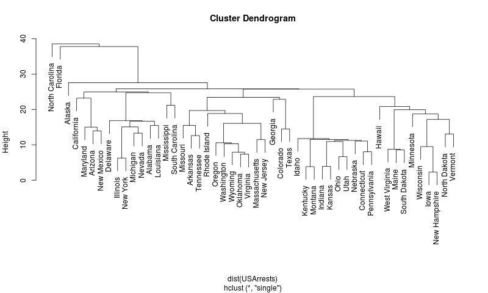
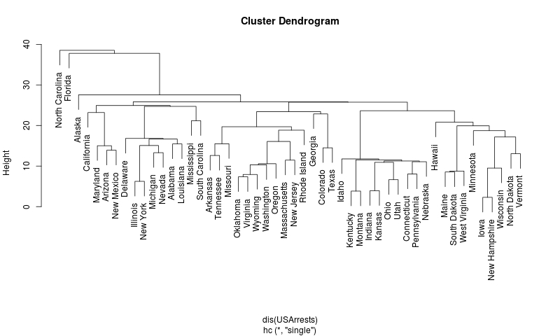

hclust_in_R
===========

This is a basic implementation of hierarchical clustering written in R.  It
produces output structured like the output from R's built in `hclust` function
in the stats package.

I wrote these functions for my own use to help me understand how a basic
hierarchical clustering method might be implemented. It's very short (the
clustering function `hc` is less than 50 lines, including comments) and easy to
experiment with, and I think it could easily be extended to other variations on
hierarchical clustering.

This implementation is less efficient than R's `hclust` (written in
Fortan), both in terms of memory use and performance. But it's easy to read and
experiment with.

The clustering method is very short and proceeds somewhat differently than R's
default method, but produces output compatible with the functions associated
with `hclust`.

The plotting methods for `hclust` output use an ordering vector to lay the
clusters out nicely and avoid branch crossings. That code is translated
verbatim from the original Fortran in the `iorder` function presented here.  It
was originally written by C  F. Murtagh, ESA/ESO/STECF, Garching, June 1991.

I include an inefficient but illustrative Euclidean distance matrix function
that is different than R's built in `dist` function. The clustering method
presented here can used either a full distance matrix or a sparse lower- or
upper-triangular one.

See the bottom of the source code file for an example.

## Example

Try this:
```R
source("hc.R")
h  = hclust(USArrests, "single")    # standard method
h1 = hc(USArrests, "single")        # our example method
```
And compare:
```
plot(h)
```

```
plot(h1)
```

